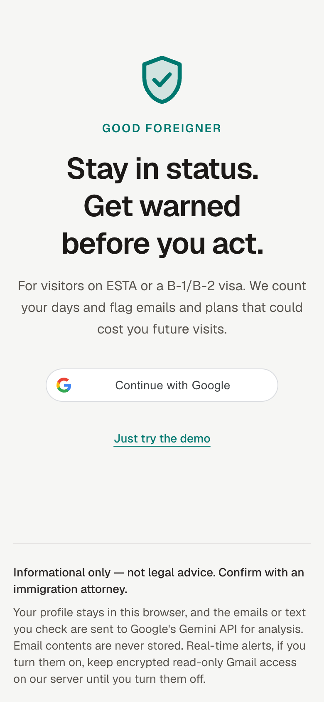
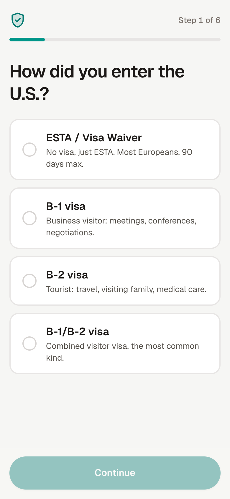
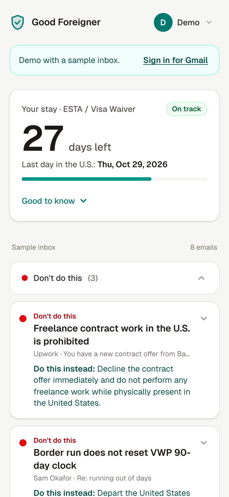
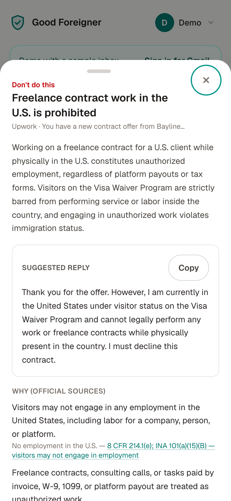

# Good Foreigner — stay in status

**Get warned before you accidentally break the rules of your U.S. visitor visa.**

Built in one afternoon at the SF Hacks x GDG AI Hackathon (October 2, 2026).
Live: https://good-foreigner-440338055401.us-central1.run.app

<p align="center">
  
  
  
  
</p>

## The problem

Millions of people visit the U.S. every year on a B-1/B-2 visa or the Visa Waiver Program (ESTA).
Many are questioned by CBP on arrival about work and intentions, and told that breaking the rules
could affect their ability to come back. The rules themselves are scattered across the Foreign
Affairs Manual, federal regulations, USCIS and CBP pages.

So visitors worry constantly, and keep asking chatbots whether something is allowed. Meanwhile
honest mistakes are easy to make: accepting a small paid gig offered after an event, overstaying by a
day, or believing that a weekend in Canada "resets" the 90 days.

Good Foreigner watches what a visitor is doing — their emails and the things they are about to do —
and warns them *before* something could violate their status, explaining why and what to do
instead.

## What it does

- **Sign in with Google and a one-question-per-step onboarding** — how you entered, arrival date,
  I-94 date (or "I'm not sure"), Gmail, phone notifications.
- **Stay countdown** — days left before your I-94 admit-until date. Dates that don't fit the visa
  (an ESTA date past day 90, a B-visa date past one year, an I-94 date before arrival) are accepted
  but flagged, and the safer date is used.
- **Inbox watch** — reads Gmail with a read-only scope and flags emails that could lead to a
  violation (paid gigs, contracts, W-9 requests, remote work, travel plans). A sample inbox works
  without signing in.
- **Real-time alerts on your phone** — Gmail push → Pub/Sub → Cloud Run → Web Push, so a risky email
  triggers a notification within seconds, even when the app is closed. Installable as a home-screen
  app.
- **Check before you act** — paste a message you're about to send, or describe a plan, and get a
  verdict.
- **Every fact is sourced.** Each alert says why, what to do instead, drafts a polite reply when an
  email asks for something risky, and links every claim to an official U.S. government source.
  Anything without an official source is marked **Unverified**.

## How it works

```
Browser ── profile in localStorage, Gmail token in memory (Google Identity Services)
   │
   ▼
Next.js API on Cloud Run
   POST /api/scan   → Gmail API (read-only) or sample inbox ─┐
   POST /api/check  → one planned action ────────────────────┤
                                                             ▼
   1. Gemma 4 (open-weight) triage: is this item immigration-relevant?
   2. Gemini structured verdict, grounded in a curated rules file with citations
```

- `lib/rules/visitorRules.ts` — 29 rules with official citations (9 FAM 402.2, 8 CFR 214.1/214.2/217,
  INA 212(a)(9)(B), 222(g), 212(q), USCIS, CBP).
- `lib/analysis/` — triage (Gemma), analysis (Gemini), pipeline.
- `lib/stay/stayCalculator.ts` — deterministic stay math, no AI.
- `lib/gmail/` — Gmail REST fetch and the read-only token flow.

## Real-time alerts (even when the app is closed)

Gmail `users.watch` → Pub/Sub topic `gmail-inbox` → push subscription → Cloud Run
`/api/gmail/push` → new INBOX messages via `users.history.list` → Gemma 4 triage → Gemini verdict →
Web Push (VAPID) → service worker → phone notification. See
`docs/superpowers/specs/2026-10-02-realtime-design.md`.

## AI models

| Model | Role | License / terms |
|---|---|---|
| **Gemma 4** (`gemma-4-26b-a4b-it`, via the Gemini API) | First-pass triage of every email and action | Open weights, [Gemma Terms of Use](https://ai.google.dev/gemma/terms) |
| **Gemini** (`gemini-3.8-flash`, via the Gemini API) | Structured risk verdicts with rule ids, explanation, safer alternative and suggested reply | [Gemini API Terms](https://ai.google.dev/gemini-api/terms) |

Model IDs are configured with `GEMMA_MODEL` and `GEMINI_MODEL`.

## Google tools used

Gemini API, Gemma 4, Google AI Studio, Gmail API (read-only, `users.watch`), Google Identity
Services (Sign in with Google), Cloud Run, Cloud Build, Artifact Registry, Pub/Sub, Firestore.

## Privacy and responsible AI

- **Read-only Gmail scope.** The access token stays in browser memory and is never stored.
- **Minimal storage.** Email bodies are never stored; the profile lives in your browser. Only if
  you turn on real-time alerts does the server keep an AES-256-GCM–encrypted read-only Gmail
  refresh token, your push subscription and processed message ids (Firestore); turning alerts off
  deletes them. Recent inbox emails are sent to Google's Gemini API for analysis. Use a
  billing-enabled (paid tier) API key so that content is not used to improve Google's products.
- **Data minimization.** Gemma 4 screens every item first; only immigration-relevant items go on to
  the larger Gemini model. Because Gemma is open-weight, this screening step could later run fully
  on-device, so irrelevant emails would never leave the phone.
- **Every fact is sourced from official U.S. government rules.** The rules file cites only official
  sources (fam.state.gov, ecfr.gov, uscode.house.gov, uscis.gov, cbp.gov). Gemini must map every
  factual claim to one of those rules (`evidence: [{ claim, ruleId }]`) and may not state legal facts
  from general knowledge. The server drops citations to unknown rules; a warning with no official
  source is raised to at least "Be careful" and marked **Unverified** in the app.
- **Honest uncertainty.** Gray areas (remote work for a foreign employer, contest prizes, job
  interviews) are labeled as gray areas, with a recommendation to confirm with an attorney.
- **Known risks.** False negatives (saying OK when it is not) are the main risk, so the app is tuned to
  over-warn. Email content is treated as untrusted data and the prompt ignores instructions inside it.

> **Informational only — not legal advice.** Confirm with an immigration attorney.

## Run locally

Requires Node 22.

```bash
npm install
cp .env.example .env.local   # fill in GEMINI_API_KEY, GEMINI_MODEL, GEMMA_MODEL, GOOGLE_CLIENT_ID
npm run dev
npm test
```

`GOOGLE_CLIENT_ID` is an OAuth 2.0 web client with `http://localhost:3000` as an authorized
JavaScript origin and the Gmail API enabled. While the OAuth consent screen is in Testing mode, add
your Google account as a test user.

## Deploy to Cloud Run

```bash
gcloud auth login
gcloud config set project YOUR_PROJECT_ID
scripts/deploy.sh
```

`scripts/deploy.sh` enables Cloud Run, Cloud Build and Artifact Registry, then deploys from source
with the values in `.env.local` passed as an env-vars file. Afterwards, add the Cloud Run URL to the
OAuth client's authorized JavaScript origins.

## License

[MIT](LICENSE)
